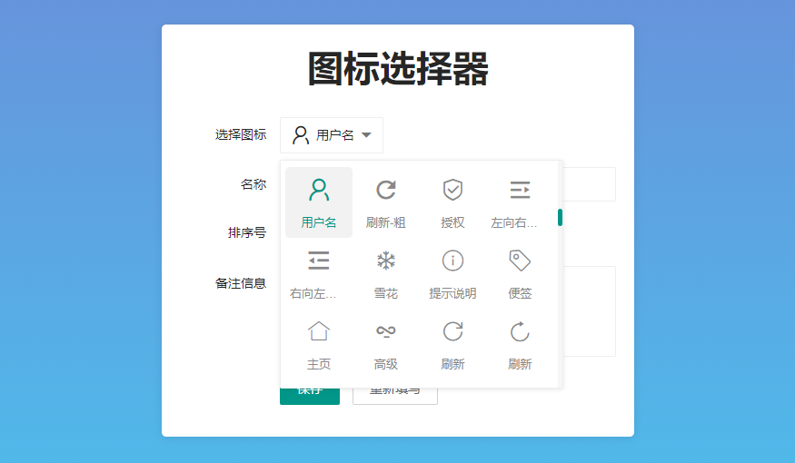

# 这是啥?

这是一款扩展了 layui 功能的插件, 能让你的输入框可以变成一个 `图标选择器`, 这意味着你现在可以很轻松的给某个东西附加一格图标的能力了, 譬如: 管理后台某个功能模块加个图标, 嗯! 就是这样!



# 怎么使用?

1. 下载源代码, 通常情况下, 你可以在 [Releases](https://gitee.com/layui-exts/icon-selected/releases) 这里找到所有已经发布的版本.
2. 将下载好的文件, 通常是压缩包, 解压到你项目的扩展目录里去, 譬如: `libs/layui_exts`
3. 确认项目的 `layui.config` 和 `layui.base` 配置是否正确, 可参考 [示例文件](./example.html)
4. 使用 `layui.use` 来引入扩展! 可参考 [示例文件](./example.html)

# 代码片段

> 仅供学习参考, 请勿无脑复制粘贴照搬照抄.

## 配置扩展

```javascript
layui
    .config({
        base: "./libs/layui_exts/",
    })
    .extend({
        iconSelected: "iconSelected/js/index",
    });
```

## 引入扩展并使用

### HTML 部分

```html
<div class="layui-form">
    <div class="layui-form-item">
        <div class="layui-form-label">选择图标</div>
        <div class="layui-input-block">
            <!-- 给输入框附加一个ID -->
            <input type="text" name="icon" value="layui-icon layui-icon-username" placeholder="请选择" maxlength="16" autocomplete="off" class="layui-input" id="icon" />
        </div>
    </div>
</div>
```

### Javascript 部分

```javascript
// 引入扩展
layui.use(["iconSelected"], function () {
    var iconSelected = layui.iconSelected;
    
    iconSelected.init("#icon");
});
```

# 文档

你可以点击 [在线文档](./docs/README.md) 开始阅读文档, 如果你已经拉取了完整的项目, 可以在本地直接打开 `docs/index.html` 来阅读离线文档! OK! 不用担心, 这没有任何的区别, 仅仅是在于你想用什么方式看文档而已!

# 支持作者

最简单的粗暴的方式就是直接使用 **钞能力**, 当然这是您自愿的! **点击可直接查看大图**

## 赞赏通道


当然, 如果客观条件不允许, 主观上不愿意, 也无伤大雅嘛! 谁的钱都是自己幸苦挣来的. 除了使用 **钞能力**, 你还可以通过以下方式支持作者!

1. 给项目点个 Star, 让更多的小伙伴知道这个扩展!
2. 积极测试, 反馈 BUG, 如果发现代码中有不合理的地方积极反馈!
3. 加入粉丝群, 看看有多少志同道合的小伙伴! <a target="_blank" href="https://qm.qq.com/cgi-bin/qm/qr?k=SykXsUtejaedB0TSs6a0_S-SseGByzdU&jump_from=webapi"></a>
