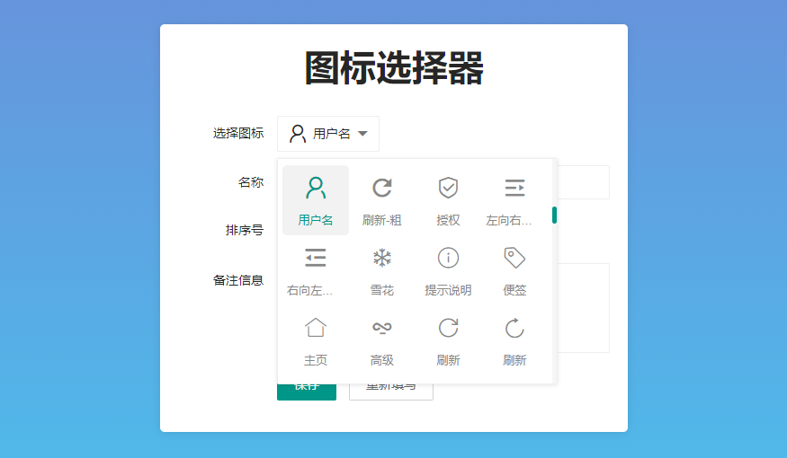

# iconSelected - 图标选择器

不要问为啥不更新 numberInput 的文档, 不要问, 问就是懒! 又给大家写了个扩展, **图标选择器**, 看图吧, 我觉得但凡不是个傻子都知道能应用在哪些场景!

应用场景比如说在后台管理系统里, 添加 **菜单** 的时候, 你肯定是希望能给菜单+个图标, 好看点, 反正我是翻遍了官方扩展站没找到我喜欢的, 所以就写了这样一个!

## 兼容性

人类浏览器 + 国产套壳浏览器+国产套壳的极速模式 + IE9~11 + Edge

## 如何使用

> 看不懂? 没关系, 直接看示例代码吧! [example.html](./example.html) 谁都逃不过真相定律!

1. 下载源代码, 国际惯例, 打开 [Releases](https://gitee.com/layui-exts/icon-selected/releases) 下载.
2. 丢到你项目里面 `layui` 的扩展目录, 如 `layui_exts`
3. 引入样式文件, 使用 `layui.config` + `layui.extend` 初始化!
4. 使用 `layui.use(["iconSelected"],function(){})` 的方式引入插件并开始使用!

# 支持我

老规矩, 有钱的捧个钱场, 没钱的捧个人场. 散会!

