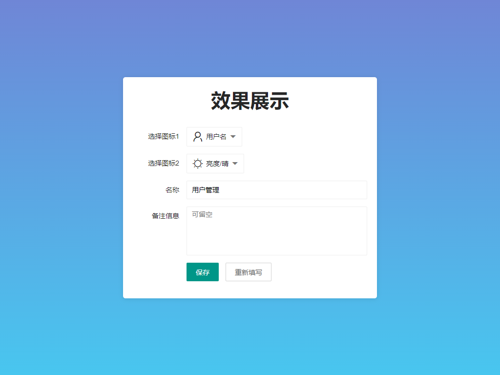
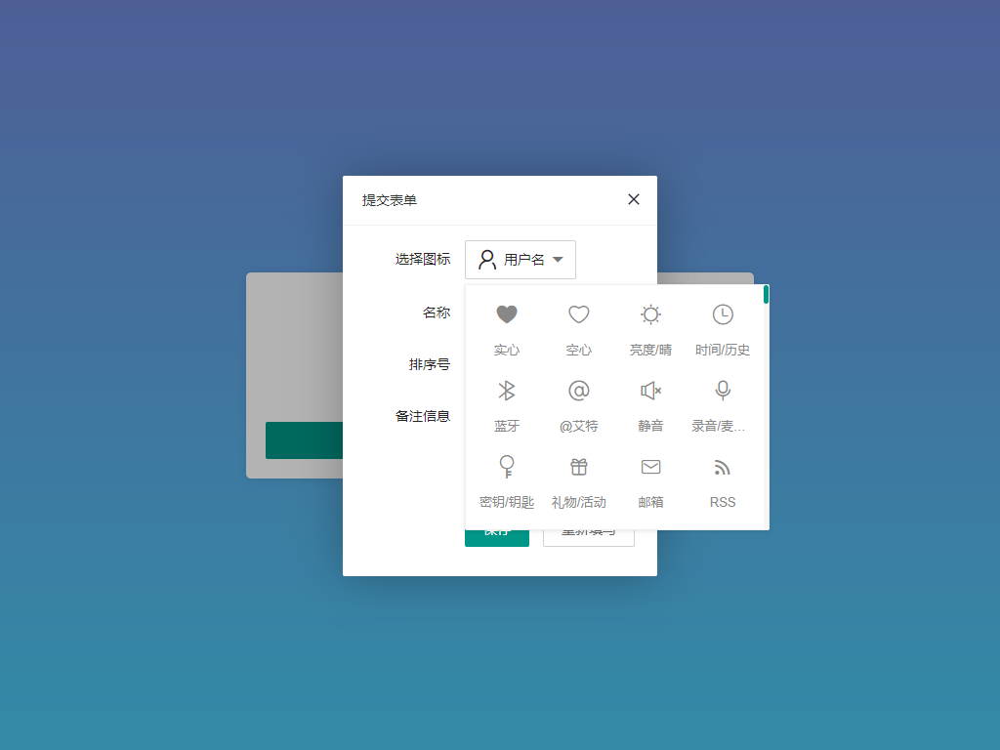

# 快速了解

基于 layui 扩展的图标选择器扩展, 常见的使用场景如管理后台"角色权限菜单"管理中, 给菜单分配图标的能力, 结合同样还是我编写的 [numberInput](https://gitee.com/layui-exts/number-input) 扩展, 你还可以给菜单增加排序能力!

# 效果展示

## 在表单内使用

> 如下配图重新截取自 v2, v1 版本不支持通过 class 绑定, 如果需要批量绑定, 可以升级到 v2, v2 于 v1 有一定改动

> 如果你已经使用了该扩展的 v1 版本, 且 v1 版本可以满足你的需求, 不建议升级 v2.



## 在弹出层内使用

> 再弹层内使用注意一点, 设置外层容器 layer 弹出层的内容容器 `.layui-layer-page .layui-layer-content` 的 `overflow` 为 `visible`; 否则会出现套在内部的弹层被容器裁剪的问题.



# 如何使用

1. 下载代码, 通常你可以在 [releases](https://gitee.com/layui-exts/icon-selected/releases) 页面下载到最新版额.
2. 解压扩展到您项目里面的扩展目录, 譬如: `libs/layui_exts`
3. 使用 `layui.config` 和 `layui.extend` 配置并注册扩展.
4. 使用 `layui.use` 来按需引用扩展并调用.

# 示例文件

> 可能由于平台规则限制, 部分 HTML 示例无法直接预览, 对于暂时无法预览的页面你可以直接拉去项目到本地阅读相关代码.

1. 常规使用: [example.html](./example.html)
2. 嵌套在弹层内使用: [layer.html](./layer.html)

# 快速上手

## 配置并注册扩展

```javascript
layui
    .config({
        base: "./libs/layui_exts/",
    })
    .extend({
        iconSelected: "iconSelected/js/index",
    });
```

## 引用并使用

```javascript
layui.use(["iconSelected"], function () {
    var iconSelected = layui.iconSelected;
    /**
     * v2 版本开始保持跟 layui 官方写法同步
     * 使用 render 方法渲染, 并且 v2 开始支持 class 批量绑定
     * v1 版本仅支持 id 绑定, 且初始化是 init
     * 请注意辨别, v2版本于2021年8月19日发布
     * 庆祝码云开放 Gitee Page 功能
     * 本组织下所有开源扩展都会于近期同步升级到v2
     * 都将统一初始化函数为  render
     */
    iconSelected.render(".layui-select-icon", {
        event: {
            select(event, data) {
                console.log("选中的图标数据", { event, data });
            },
        },
    });
});
```

## 可配置项目

> 本扩展配置项很少, 几乎都是写死的设定一般不需要修改. 当然我会告诉你有哪些配置项!

## 使用配置项

```javascript
layui.use(["iconSelected"], function () {
    var iconSelected = layui.iconSelected;

    // 第二个参数用于接收配置项
    iconSelected.render(".layui-select-icon", {});
});
```

## 可用配置项

-   width

    -   弹窗的宽度
    -   默认: 300

-   icons

    -   图标列表
    -   默认: layui 默认图标
    -   参考: [https://www.layui.com/doc/element/icon.html](https://www.layui.com/doc/element/icon.html)

-   placeholder

    -   输入框提示文字
    -   默认: 请选择

-   value

    -   当前选中值
    -   默认: 输入框的值
    -   注意! 理论上该值一定是字体图标的样式名, 如: `layui-icon layui-icon-username`

-   zIndex
    -   zIndex 值
    -   默认值:
        -   老版本为: `999`
        -   在: `v1.0.2.20210616` 改为 `19961005`
    -   别告诉我你不知道 zIndex 啥意思!

## 需要注意的配置项

> 在 `v1.0.3.20210713` 之前 `offsetX` 和 `offsetY` 的作用是偏移弹层, 弹层的实现逻辑是 `fixed` 绝地定位, 即 offsetX(Y) 是相对于 自身为止(基于浏览器窗口) 进行偏移, 主要考虑场景是部分特别小的窗口内嵌选择器显示不全的问题

> 在 `v1.0.3.20210713` 开始变为 `absolute` 相对定位, 更加简便, 即 offsetX(Y) 对应着 自身(相对于父元素)偏移量

-   offsetX

    -   弹窗 X 轴偏移量
    -   默认: 30
    -   在 `v1.0.3.20210713` 变更为 `0`
    -   不建议修改

-   offsetY

    -   弹窗 Y 轴偏移量
    -   默认: 10
    -   在 `v1.0.3.20210713` 变更为 `5`
    -   不建议修改

---

# 事件

本扩展就一个事件, 同样是写在 `event` 下面, 该事件为 `select` 事件, 即选中某个图标时触发, 参考代码如下!

```javascript
layui.use(["numberInput", "layer", "iconSelected", "form"], function () {
    var iconSelected = layui.iconSelected;

    iconSelected.render(".layui-select-icon", {
        event: {
            select(event, data) {
                console.log("选中的图标数据", { event, data });
            },
        },
    });
});
```

---

# API

!> 如果你想使用 API 服务, 那么请确保扩展版本高于等于 `v1.0.1.20210609`, API 的调用方式为: `iconSelected.xxx`, 譬如: `iconSelected.icons` 即可获取默认图标列表

!> 添加图标操作都是支持链式写法的, 即 `iconSelected.addIcon().addIcon()......init()` 这样, 但是请注意! 因为渲染顺序问题, 如果要添加图标确保 初始化 API 在最后面!

## render

-   初始化
-   在 `v1` 版本为 `init`
-   这就没啥好说的了
-   如果需要添加图标请保证该 API 在最后面调用!

## icons

-   取出默认的图标数据
-   即 layui 官方图标清单

## addIcon(name,classList)

-   添加一个图标(在尾部)
-   参数分别为:
    -   显示的名字
    -   图标的样式

## addIcons(icons)

-   批量添加图标(在尾部)
-   参数为数组
-   你需要自行维护数组内部的键值对, 确保键值对符合规范格式
-   即: name=名字, classList=图标

## addIconBefore(name,classList)

-   添加一个图标(在头部)
-   其他的就跟 addIcon 一样了

## addIconsBefore(icons)

-   批量添加图标(在头部)
-   其它的就跟 addIcons 一样了

# 支持作者

最简单的粗暴的方式就是直接使用 **钞能力**, 当然这是您自愿的! **点击可直接查看大图**

## 钞能力通道


当然, 如果客观条件不允许, 主观上不愿意, 也无伤大雅嘛! 谁的钱都是自己幸苦挣来的. 除了使用 **钞能力**, 你还可以通过以下方式支持作者!

## 打工人通道

1. 给项目点个 Star, 让更多的小伙伴知道这个扩展!
2. 积极测试, 反馈 BUG, 如果发现代码中有不合理的地方积极反馈!
3. 加入粉丝群, 看看有多少志同道合的小伙伴! 群号: **690109078**
